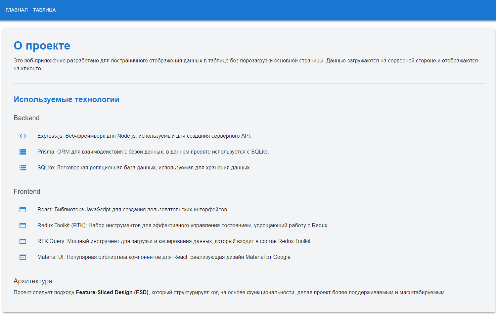

📖 The web application is designed to conveniently display the data table page by page, providing a smooth user experience without the need to reload the page. Data is loaded from an external file, processed and stored in a database, from where it is then displayed on the screen as a convenient table. The project architecture is built to support high flexibility and modularity, making it easy to add new features and scale the solution in the future.

<h2> 🧰 Languages and Tools </h2>

          
          
 

<h2> 📱 Interface </h2>

<h3> 🏠 Home page  </h3>

<h3> 📋 The Table </h3>

